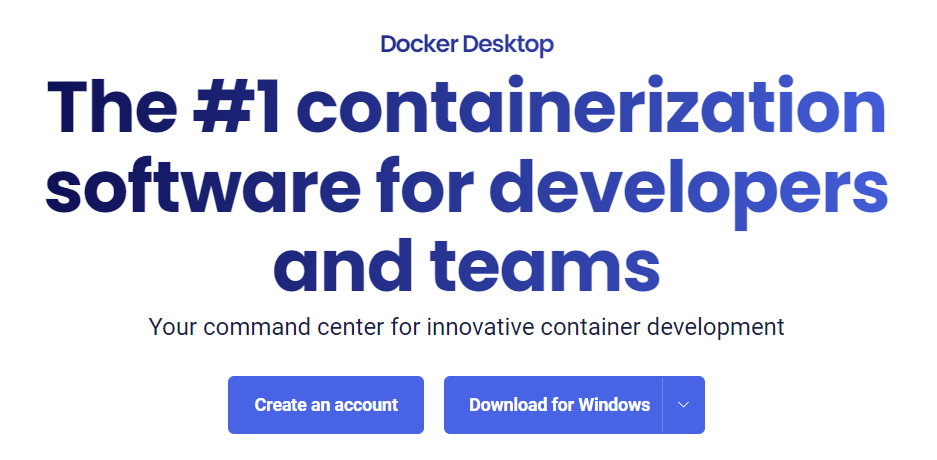
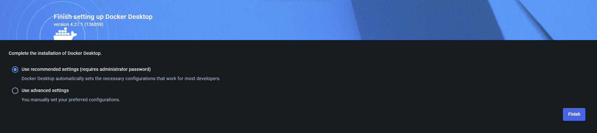
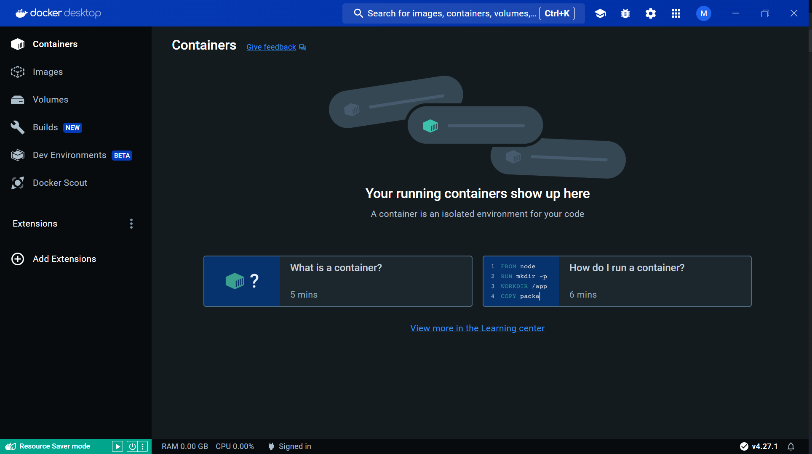
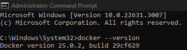
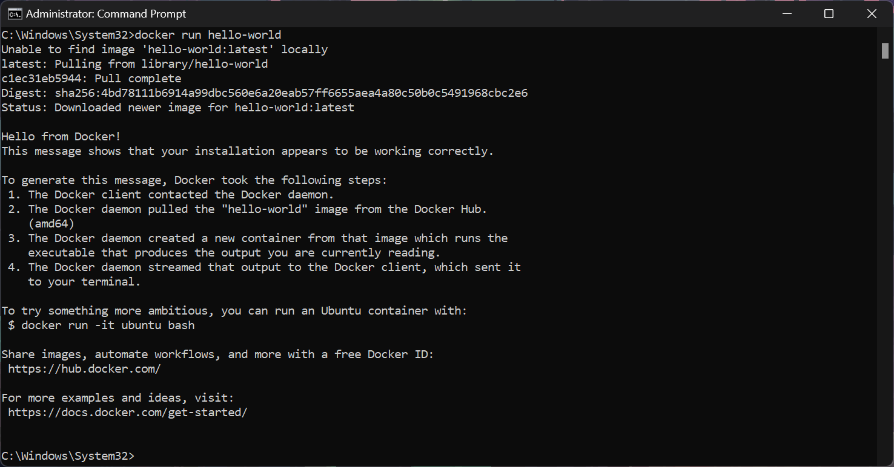

# Streamlit-Deployment-Tutorial
Learn how to deploy your Streamlit app to the web using Google Cloud Platform
and Docker.

Step by step docker instructions

1. Install Docker. 
 - Navigate to the [Docker Desktop download page](https://www.docker.com/products/docker-desktop/)


 - Click Download for Windows (or hover for other options), and download the
   **Docker Desktop Installer**.



 - Run the installer.
 - Once installation is complete, you'll have to restart your PC.
  
  
2. Complete Installation.
 - After restarting, open the Docker Desktop app and complete the installation
   by accepting the the terms and selecting "Use recommended settings" and
   clicking finish.
   
- Create a new account or sign in to Docker using GitHub.
- Once logged in your Docker account, your docker app should look something
  like this:
  


 - Open a terminal or command prompt and verify that Docker
   is properly installed by running:
   ```cmd
   docker --version

   ```
   You should see something like this:
   
   

- Test Docker by running the following command:
  ```cmd
  docker run hello-world
  ```
     You should see something like this:
   
   