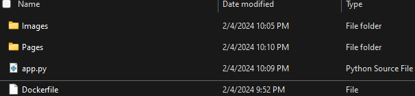

<h1 align="center">
    
</h1>
<h1 align="center">
    <b>Streamlit App Deployment Tutorial</b>
    <br>
</h1>
<h4 align="center">
    <em>Learn how to deploy your Streamlit app to the web using Google Cloud Platform and Docker.</em>
</h4>
<br></br>

## Table of Contents

1. [Docker Installation](#docker-installation)
2. [Google Cloud Platform (GCP) Account Setup](#google-cloud-platform-gcp-account-setup)
3. [Configure Google Cloud SDK](#configure-google-cloud-sdk)
4. [Create a Dockerfile](#create-a-dockerfile)
5. [Build a Docker Image](#build-a-docker-image)
6. [Tag and Push the Docker Image to Google Container Registry](#tag-and-push-the-docker-image-to-google-container-registry)
7. [Deploy the Streamlit App on Google Cloud Run](#deploy-the-streamlit-app-on-google-cloud-run)


<br></br>

# Docker Installation

- Navigate to the [Docker Desktop download page](https://www.docker.com/products/docker-desktop/)
- Click Download for Windows (or hover for other options), and download the **Docker Desktop Installer**.


- Run the installer.
- Once installation is complete, you'll have to restart your PC.
- After restarting, open the Docker Desktop app and complete the installation by accepting the terms and selecting "Use recommended settings" and clicking finish.


- Create a new account or sign in to Docker using GitHub.
- Once logged into your Docker account, your Docker app should look something like this:


- Open a terminal or command prompt and verify that Docker is properly installed by running:

    ```cmd
    docker --version
    ```

    You should see something like this:

    

- Test Docker by running the following command:

    ```cmd
    docker run hello-world
    ```

    You should see something like this:

    

<br></br>

[Return to Table of Contents](#table-of-contents)

<br></br>

# Google Cloud Platform (GCP) Account Setup

- First, you'll need a Google account. If you don't have one, create one [here](https://support.google.com/accounts/answer/27441?hl=en).

  - Google Cloud offers $300 dollars in free credits, so if you've already exhausted these with your current Google account (or simply prefer to manage your GCP separately from your main Google account), I would suggest creating a new one.

  Whether or not you choose to utilize the free credits, payment information is required. However, rest assured that the likelihood of incurring charges is minimal when using a small dashboard app, provided you do not exert substantial computing power. You have the option to deactivate the app from the console, preventing access, and can configure notifications to alert you about any potential charges. The free $300 in credits will go a long way!


- Once you have a Google account, sign in to the [Google Cloud Console](https://console.cloud.google.com/).
- Click on the "Select a project" drop-down menu at the top left of the page and select "New Project".


- Add a project name and click "CREATE" (You can ignore the Location option)

- You should get a notification that your project has been created.

- In the left-hand navigation menu, click on "APIs & Services" and then "Library."

- In the search bar, type "Artifact Registry API" and select it from the list.

- Click the "Enable" button to enable the API.

<br></br>

[Return to Table of Contents](#table-of-contents)

<br></br>

# Configure Google Cloud SDK

- Navigate to the [gcloud CLI documentation](https://cloud.google.com/sdk/docs/install) and download the Google Cloud CLI installer.
- Install the Google Cloud CLI. Make sure bundle Python is selected.
- After installation, run the following command to initialize the SDK:

    ```cmd
    gcloud init
    ```

- When prompted, hit "y" and then enter to log in. A browser window will open prompting you to log in. Use the account you created your GCP project with, and then hit "Continue" and "Allow".
    
- You will be asked to select a cloud project to use. Type in the number next to the name of the one you've created for this deployment (if you only have one, it should just be 1), and hit enter. This will configure your Google Cloud SDK.


<br></br>

[Return to Table of Contents](#table-of-contents)

<br></br>

# Create a Dockerfile

- Open a text editor on your computer (like Notepad on Windows, TextEdit on macOS, or any code editor like VSCode).
- Copy and paste the following content into the text editor:

    ```dockerfile
    # Use an official Python runtime as a parent image
    FROM python:3.8

    # Set the working directory to /app
    WORKDIR /app

    # Copy the current directory contents into the container at /app
    COPY . /app

    # Install any needed packages specified in requirements.txt
    RUN pip install --no-cache-dir -r requirements.txt

    # Make port 8501 available to the world outside this container
    EXPOSE 8501

    # Define environment variable
    ENV NAME World

    # Run app.py when the container launches
    CMD ["streamlit", "run", "app.py"]
    ```

- Save this file in the root directory of your Streamlit app with the name Dockerfile (make sure it's not saved with a .txt extension).

<br></br>

[Return to Table of Contents](#table-of-contents)

<br></br>


- Next, we will need to create a requirements.txt. This will provide the required packages to run your app.

- Open a text editor on your computer.
- Write the name of any packages required to run your app (streamlit, pandas, etc) and their specific versions if necessary. It should look something like this:


- Verify it is saved within your App's root directory:


Now that you have the Dockerfile and requirements.txt ready, we can build a
Docker Image.

<br></br>

[Return to Table of Contents](#table-of-contents)

<br></br>

# Build a Docker Image

- Open a terminal or command prompt.
- Navigate to the directory where your Dockerfile and requirements.txt are located. You can use the cd command to change directories:

    ```cmd
    cd /path/to/your/app
    ```

- Build the Docker image using the following command:

    ```cmd
    docker build -t your-image-name .
    ```

    (Replace your-image-name with a unique name for your Docker image. This command tells Docker to build an image using the Dockerfile in the current directory.)

    Once completed, you should see something like this:


Verify the image exists and view its tag by running:
```cmd
docker images
```


<br></br>

[Return to Table of Contents](#table-of-contents)

<br></br>

# Tag and Push the Docker Image to Google Container Registry

- While still within the directory where your Dockerfile is located, run the following command:

    ```cmd
    gcloud auth login
    ```

    - Log in, and then run the following command:

    ```cmd
    gcloud auth configure-docker
    ```

    - Hit "y" when prompted.

- Tag your Docker image with the Google Container Registry (GCR) URL:

    ```cmd
    docker tag your-image-name:tag gcr.io/your-project-id/your-image-name:tag
    ```

    (Replace "your-image-name:tag" with the image name and tag you used in the previous step, and "your-project-id" with your actual GCP project ID.)


- Run the following command:

    ```cmd
    docker push gcr.io/your-project-id/your-image-name:tag
    ```

    If successful, it should look something like this:


<br></br>

[Return to Table of Contents](#table-of-contents)

<br></br>

# Deploy the Streamlit App on Google Cloud Run

- Open the [Google Cloud Console](https://console.cloud.google.com/)
- In the left-hand navigation menu, click on "Cloud Run."
- Click the "Create Service" button.
- Select your project and region.
- Select "CPU is only allocated during request processing."
- Allow unauthenticated invocations.
- Hit create.


Congratulations! You've successfully deployed your first Streamlit App!
